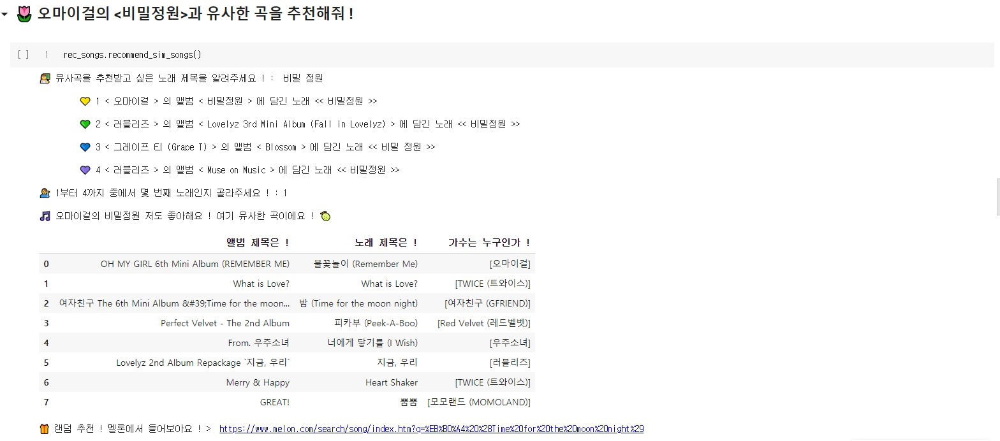
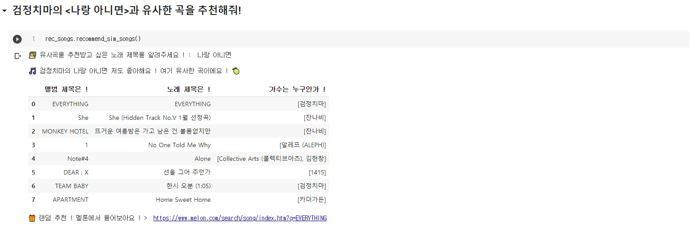
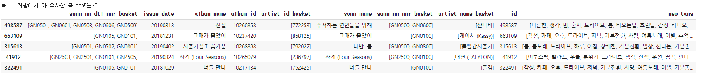

# 🎵 Similar Song Finder

### 요새 꽂힌 그 노래와 비슷한 노래가 궁금해 !

> Goal : Melon의 유사곡 찾기 따라잡기 😎 

유사한 곡 상위 10개를 골라 추천하고 멜론 링크를 제공합니다. 
  

## :musical_keyboard: 기능

### :radio: 유사한 곡을 찾고 싶은 곡 명을 "마음대로" 입력하세요!

* 띄어쓰기를 하지 않아도, 다음처럼 특수 문자를 포함시켜도 괜찮습니다.

  

* 동명의 곡이 여러 곡인 경우/여러 버전이 있는 경우에도 사용자가 원하는 곡을 제대로 찾을 수 있도록 합니다.  

  

#### 1 ) 동명의 곡이 여러개인 경우, 어느 곡인지 사용자에게 선택하도록 요청합니다. 

  

#### 2 ) 만약 곡이 유일한 경우, 사용자에게 선택을 요구하지 않고 바로 추천 결과를 띄웁니다.  

  

#### 3 ) 만약 DB에 등록되지 않은 곡이라면, 아무 노래나 랜덤으로 골라 추천하고 멜론 링크를 제공합니다.  

### :radio: ​가장 유사한 곡 top 10과 멜론 링크를 제공합니다.

query 곡과 가장 유사한 상위 10곡을 추천하고, 10곡 중 한 곡을 랜덤으로 골라 멜론에서 들어볼 수 있도록 링크를 제공합니다.

모든 추천 곡이 마음에 든다면? [haeuuu/Melon-playlist-generater Repository](https://github.com/haeuuu/Melon-playlist-generater)와 연결하여 자동으로 멜론 플레이 리스트에 추가할 수 있도록 구현할 수 있습니다!

  

## :musical_keyboard: 개발 과정

### :radio: 곡 사이의 유사함을 어떻게 판별하나요?

* [haeuuu/AutoEncoder-for-Collaborative-filtering](https://github.com/haeuuu/AutoEncoder-for-Collaborative-filtering)를 이용하여 song embedding을 학습하였습니다.

  4개의 layer가 input vector를 1024차원까지 축소시켰다가 복원하는 작업을 반복하며 1024차원의 song embedding을 생성합니다.

* 이후 cosine simliarity 또는 dot product를 이용하여 `sim_songs = {'song1' : [song_rank1, song_rank2, ...], ...}` 를 생성합니다. key는 query song, value는 유사도에 따라 내림차순 정렬된 song list입니다. 

  

### :radio: query를 탐색하는 방법

* Trie를 이용하여 50만개의 곡 중 query곡을 빠르게 탐색할 수 있도록 구현하였습니다.
* 27만개의 곡을 for문으로 탐색하는 데에 약 0.07초, trie를 이용하면 약 0.01초가 소요됩니다.

  

## :musical_keyboard: 신기한점 한 가지 !

#### 실제로 멜론에서 제공하는 유사곡 결과와 비슷했다 !!

> cosine similarity가 아니라 그냥 dot product를 한 결과를 이용하면 다음처럼 유사곡 추천 결과가 약간 바뀐다.

지금은 아니지만 얼마전까지만 해도 **장범준의 노래방에서**의 유사곡을 누르면 꼭 **태연의 사계**가 함께 나왔다.  

대체 장르도 가사 내용도 다른 이 두 곡이 왜 유사곡일까? 혼자 생각하다가 찾아낸 것이  

1. 두 곡이 비슷한 시기에 발매되었다. 19년 2월과 3월.
2. 두 곡 모두 장기간 상위권을 차지했다.

라는 공통점이었다 ! 이걸 깨닫고나니 **'멜론은 함께 많이 담으면 유사곡으로 생각하나보네?'** 하는게 내 결론이었다.  
top100을 듣는 사람도 많을 뿐더러 두 곡 모두 대중들에게 인기가 많았기 때문에 분명 다수의 플레이 리스트에 함께 들어가있었을 것이다.  

여기까지는 그냥 나만의 가설이었는데, 내가 직접 구현한 "유사곡 찾기" 에서도 똑같은 결과를 보여주었다.  

아주 아주 신기하고 재밌는 경험이다 ㅎㅎㅎ

