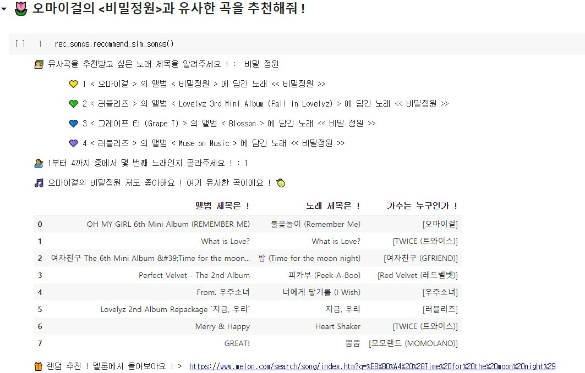
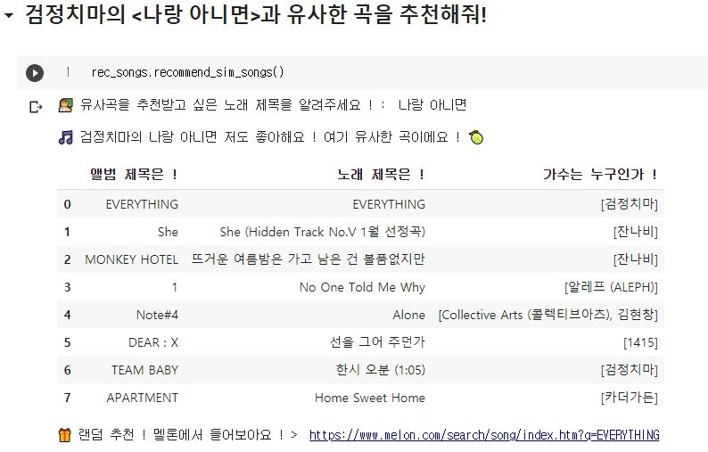

# 🎵 Similar Song Finder
### Song Finder 요새 꽂힌 그 노래와 비슷한 노래가 궁금해 !
> Goal : Melon의 유사곡 찾기 따라잡기 😎  

query곡과 유사한 곡 상위 10개를 골라 추천하고 멜론 링크를 제공합니다.
* Trie를 이용하여 50만개의 곡 중 query곡을 빠르게 탐색할 수 있도록 구현하였습니다.
  27만개의 곡을 for문으로 탐색하는 데에 약 0.07초, trie를 이용하면 약 0.01초가 소요됩니다.
* [Melon-playlist-generater Repository](https://github.com/haeuuu/Melon-playlist-generater)와 연결하여 자동으로 멜론 플레이 리스트에 추가할 수 있도록 구현할 수 있습니다.    
  
## 기능
##### 추천받고 싶은 곡 명을 입력하면, 어떤 곡인지 선택할 수 있습니다.
동명의 곡이 여러 곡인 경우, 여러 버전이 있는 경우에도 사용자가 원하는 곡을 제대로 찾을 수 있도록 합니다.
* 여러개의 곡 중 어느 곡인지 사용자에게 선택하도록 요구합니다.  
  

* 만약 곡이 유일한 경우, 사용자에게 선택을 요구하지 않고 바로 추천 결과를 띄웁니다.  
  

* 만약 DB에 등록되지 않은 곡이라면, 아무 노래나 랜덤으로 골라 추천하고 멜론 링크를 제공합니다.  
  

  
    
##### 가장 유사한 곡 top 10과 멜론 링크를 제공합니다.
query 곡과 가장 유사한 상위 10곡을 추천하고, 10곡 중 한 곡을 랜덤으로 골라 멜론에서 들어볼 수 있도록 링크를 제공합니다.  
   
---
    
### 신기한점 한가지 : 실제로 멜론에서 제공하는 유사곡 결과와 비슷했다 !

> cosine similarity가 아니라 그냥 dot product를 한 결과를 이용하면 다음처럼 유사곡 추천 결과가 약간 바뀐다.

지금은 아니지만 얼마전까지만 해도 **장범준의 노래방에서**의 유사곡을 누르면 꼭 **태연의 사계**가 함께 나왔다.  

대체 장르도 가사 내용도 다른 이 두 곡이 왜 유사곡일까? 혼자 생각하다가 찾아낸 것이  

1. 두 곡이 비슷한 시기에 발매되었다. 19년 2월과 3월.
2. 두 곡 모두 장기간 상위권을 차지했다.

라는 공통점이었다 ! 이걸 깨닫고나니 **'멜론은 함께 많이 담으면 유사곡으로 생각하나보네?'** 하는게 내 결론이었다.  
top100을 듣는 사람도 많을 뿐더러 두 곡 모두 대중들에게 인기가 많았기 때문에 분명 다수의 플레이 리스트에 함께 들어가있었을 것이다.  

여기까지는 그냥 나만의 가설이었는데, 내가 직접 구현한 "유사곡 찾기" 에서도 똑같은 결과를 보여주었다.  
오직 CF 기반으로 만든 유사곡 추천 모델에서 멜론과 같은 결과를 보여주었다는 것은, 멜론에서도 사용자들이 만든 playlist를 유사곡 추천에 적극 이용하고 있다는 증거가 아닐까!  
  
내가 의문을 품었던 점이 이렇게 풀리다니 아주 아주 신기하고 재밌는 경험이다 ㅎㅎㅎ

